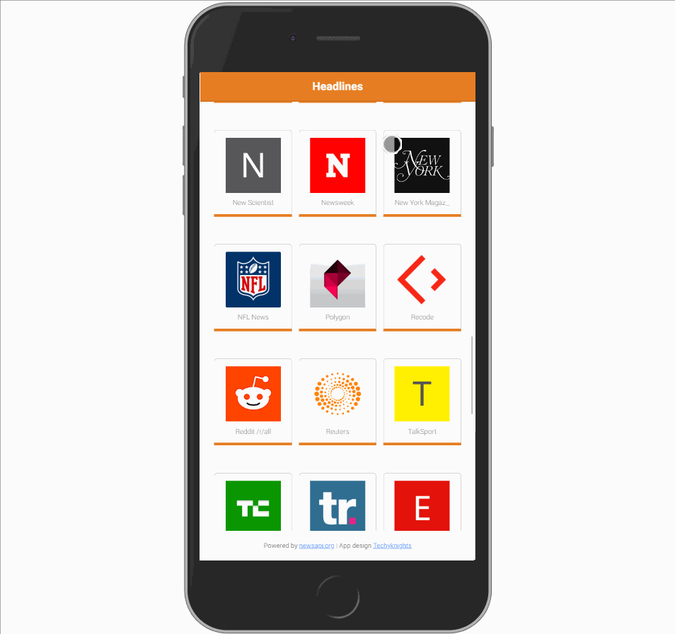

# A2ZNews App

This app is made using [NewsApi](http://newsapi.org/) api.

## Install [node_modules](https://www.npmjs.com/package/node-modules) package:
```
npm install -g node-modules (g for global)
```
## To run the code in your browser
Make sure you have ionic cli on your system.Once you have it, you can enter the below command

```
To launch the app in the browser : ionic serve
```
## To run the code in Emulator
```
To launch the app in the simulator(Android/ios) - ionic cordova run android/ios --livereload 

(Livereload is do reload the app in the simulator whenever there is a change in the code)
```
## App on Mobile:


**If you want to turn your site/blog into this type of app , you can contact me at yashwanthdeveloper@gmail.com**
